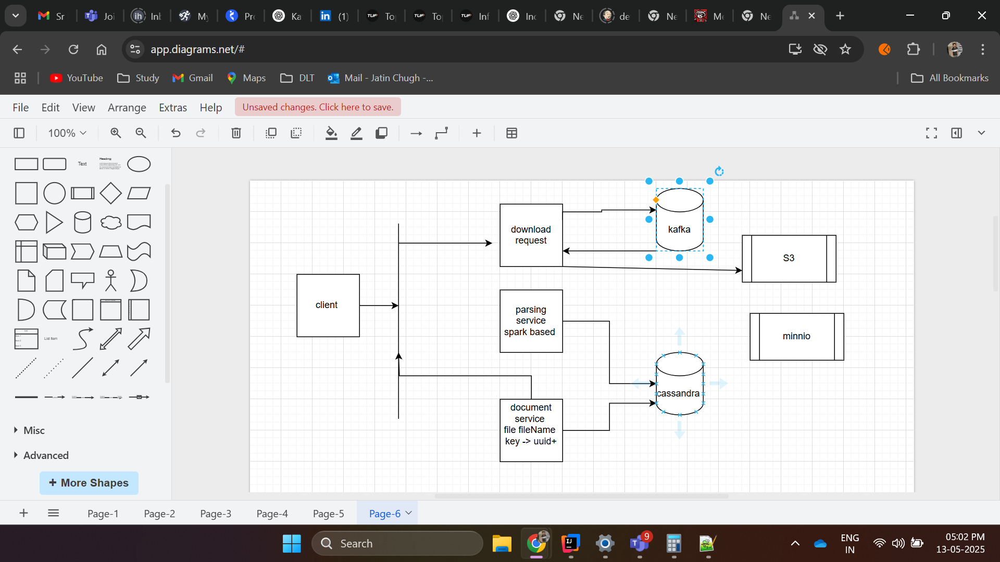

  define current system architecure full .  
  cross question on current architecutre 
  
 then design two apis 
 first which will download the document for the  given path  -> we cn't return response as we are having million of files 
 and in each files milion of records 
files will contain information like file id name , server , ip address 

now right a second api which  return all the information from the file  , based on ip address 

feedback is good 
i am able to design the sytem 
but failed to desing the file prcoessing service as i tried to give solution on java based
but java is not good for large data set 
So we need to use other frame work like apache splunk etc 

